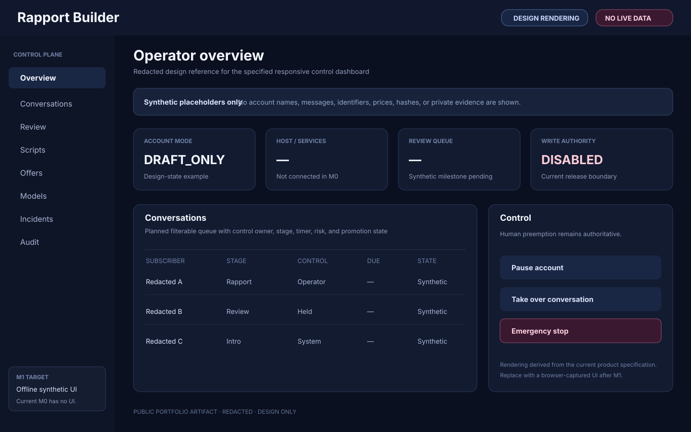
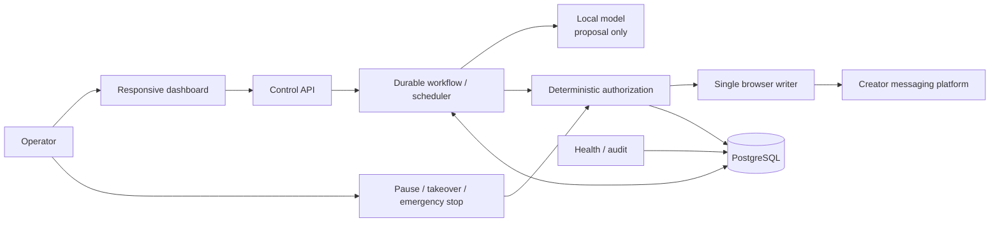

# Rapport Builder

[](https://github.com/nguyen0319/rapport-builder/actions/workflows/docs-ci.yml)

**Status:** Active development · Deterministic authority baseline under independent review · Private implementation source · Walkthrough available on request

**Scale:** No live-account operating runs are claimed. The current milestone is an engineering-control baseline for a single-host, single-account MVP.

## What it is

Rapport Builder is a local-first, human-supervised AI conversation-operations platform for creator messaging. It is designed to reduce repetitive conversation work without giving a language model direct account authority. The model may interpret context and propose language, while deterministic software owns permissions, control state, freshness, approved commercial terms, safety holds, and write authorization. A human operator remains able to pause, take over, review, or revoke automation.

This repository is a public engineering portfolio. It contains architecture, a reduced public contract, and redacted product artifacts only; the private application source and sensitive data are not included.

## Built with

**Implemented today:** Python 3.12 · JSON Schema · pytest · Ruff · Mypy · GitHub Actions  
**Specified next layers:** Next.js · TypeScript · FastAPI · PostgreSQL · Playwright · local llama.cpp inference

## Operator UI



> **UI evidence note:** the current private milestone contains no implemented product UI. The image above is a redacted, design-accurate rendering of the specified operator dashboard, clearly labeled as a design artifact. It will be replaced by a browser-captured application screenshot after the offline dashboard milestone is implemented.

## Architecture



The architecture is organized around authority rather than premature service count. The implemented baseline is the deterministic authorization core; dashboard, API, durable workflow, model, browser, and persistence layers are staged behind later release gates.

## System layers

- **Control plane** — the responsive dashboard and API are specified to expose monitoring, review, pause, takeover, and emergency-stop commands without carrying platform credentials on the client.
- **Durable workflow** — PostgreSQL is specified as the authoritative state, scheduling, lease, version, approval, and audit store so actions survive restarts and can be reconciled.
- **Conversation reasoning** — a local model is intended to assemble a structured proposal from approved script, memory, and recent context; it is not allowed to choose its own permissions.
- **Deterministic authorization** — the implemented Python authority contract validates release stage, control mode, emergency stop, approvals, hashes, epochs, versions, and connector evidence with explicit fail-closed decisions.
- **Execution boundary** — a visible browser worker is specified as the sole future platform writer and must revalidate authority immediately before any write.
- **Learning pipeline** — rights-cleared historical data is planned to move through quarantine, de-identification, review, versioning, retrieval, and optional offline adaptation rather than continuous self-training.

## Proposal / authorization / execution

The strongest boundary in Rapport Builder separates language generation from authority. The proposal side is responsible for conversational interpretation and wording. It may suggest a reply or an approved offer category, but it cannot set prices, change account mode, advance control epochs, authorize a browser action, or approve itself.

The authorization side is deterministic. It evaluates the current release stage and mode, emergency-stop state, connector state, account and conversation epochs, version freshness, action digest, human approval, and independent-checker evidence. Unknown or malformed authority input is denied rather than guessed. In the current baseline, stages M0 through M3 cannot authorize an application-mediated platform write.

The execution side is separately constrained: the future browser worker is the only component allowed to write to the platform, and it must re-check the final command before execution. This separation is intended to prevent stale sends, duplicate/conflicting actions, model self-escalation, unsupported commercial terms, and automation continuing after a human takeover or emergency stop.

## Redacted public contract

```json
{
  "action": "EXECUTE_PLATFORM_WRITE",
  "mode": "DRAFT_ONLY",
  "control": {
    "account_epoch": 12,
    "conversation_epoch": 41
  },
  "decision": {
    "allowed": false,
    "code": "RELEASE_STAGE_NO_WRITE"
  },
  "created_at": "<redacted>"
}
```

The machine-readable example in [`docs/sample-authorization.schema.json`](docs/sample-authorization.schema.json) is intentionally smaller and more general than the private application contract. It shows the public shape of an authorization snapshot without exposing account identifiers, hashes, policy versions, evidence records, or proprietary workflow detail.

## Implemented and exercised

- A Python 3.12 deterministic authority contract with explicit release-stage capabilities and default-deny behavior.
- Runtime normalization and stable denial codes for malformed authority input.
- M0–M3 no-write enforcement, emergency-stop/recovery rules, human approval checks, and stale epoch/version rejection.
- Public-schema counterparts, package validation, linting, type checking, tests, repository-manifest checks, and CI evidence. The milestone remains under independent review and is not presented here as a production release.

## Specified and still being expanded

The next milestones add the offline Next.js/FastAPI/PostgreSQL simulator and responsive dashboard, local-model shadow evaluation, read-only browser shadow integration, and later a human-approved write path only if external platform/account/legal/privacy authority is documented. Bounded low-risk automation, rights-cleared retrieval/adaptation, endurance testing, backup/recovery drills, and broader production hardening remain later work.

## Contact and license

For a technical walkthrough or architecture discussion, email **nguyen.jimmy.2898@gmail.com**.

Public documentation and redacted portfolio artifacts are © 2026 Jimmy Nguyen. All rights reserved; see [`LICENSE`](LICENSE). The private application source, private datasets, credentials, and proprietary implementation details are not included.
